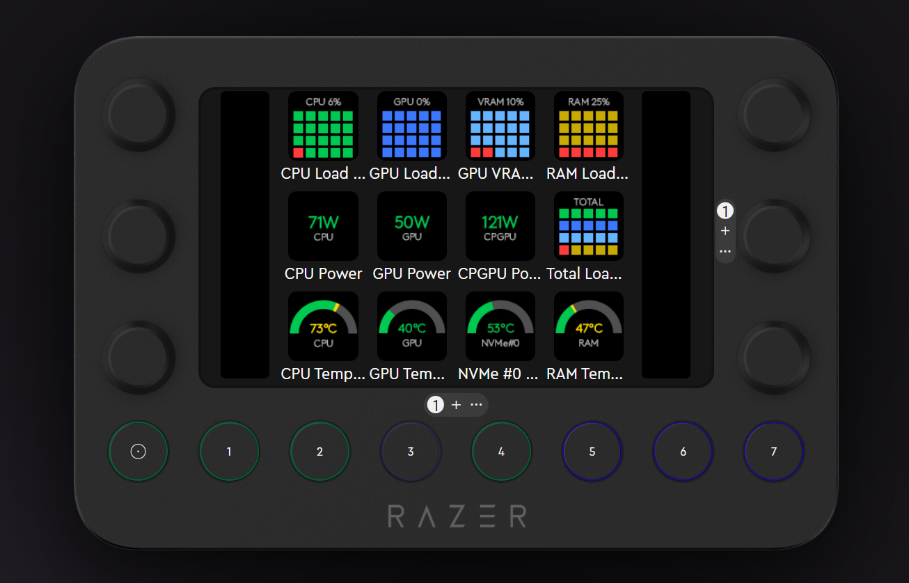

# Loupedeck Libre Hardware Monitor Plugin

<a href="https://buymeacoffee.com/Weniverse"></a>

Loupedeck / Razer Stream Controller plugin that displays real-time hardware sensor data from [Libre Hardware Monitor](https://github.com/LibreHardwareMonitor/LibreHardwareMonitor).



## Features

### 29 Dynamic Actions across 3 View Types

**Text View** — sensor value displayed as text

| Action | Description |
|--------|-------------|
| CPU Temp | CPU core temperature |
| GPU Temp | GPU core temperature |
| RAM Temp | RAM (DIMM) temperature |
| CPU Load | CPU total load % |
| GPU Load | GPU core load % |
| GPU VRAM | VRAM usage (MB) |
| GPU VRAM % | VRAM usage % |
| RAM Usage | RAM usage (GB/Total) |
| CPU Power | CPU package power (W) |
| GPU Power | GPU power (W) |
| CPGPU Power | CPU + GPU combined power (W) |
| NVMe #0–#4 Temp | NVMe drive temperatures |

**Block Graph View** — percentage shown as filled blocks

| Action | Description |
|--------|-------------|
| CPU Load (Block) | 5x4 block graph |
| GPU Load (Block) | 5x4 block graph |
| GPU VRAM (Block) | 5x4 block graph |
| RAM Load (Block) | 5x4 block graph |
| Total Load (Block) | 4-row combined: CPU, GPU, VRAM, RAM |

**Arc Gauge View** — temperature shown as colored arc

| Action | Description |
|--------|-------------|
| CPU Temp (Gauge) | Arc gauge with color thresholds |
| GPU Temp (Gauge) | Arc gauge with color thresholds |
| RAM Temp (Gauge) | Arc gauge with color thresholds |
| NVMe #0–#4 (Gauge) | Arc gauge per NVMe drive |

## Requirements

- **Windows** 10 or later
- **[Libre Hardware Monitor](https://github.com/LibreHardwareMonitor/LibreHardwareMonitor)** with HTTP server enabled on port **8085**
- **Loupedeck** or **Razer Stream Controller** software (v6.0+)

### Enabling LHM HTTP Server

1. Open Libre Hardware Monitor
2. Go to **Options > Remote Web Server**
3. Set port to **8085**
4. Click **Run** or enable auto-start

## Installation

1. Download `LHMMonitorPlugin.lplug4` from the [Releases](https://github.com/Weniverse-git/Loupedeck-Libre-Hardware-Monitor/releases) page
2. Double-click the downloaded file
3. Restart Loupedeck / Razer Stream Controller software
4. Find actions under the **Hardware Monitor** category

## Build from Source

```bash
# Prerequisites: .NET 8 SDK

# Clone
git clone https://github.com/Weniverse-git/Loupedeck-Libre-Hardware-Monitor.git
cd Loupedeck-Libre-Hardware-Monitor

# Build
dotnet build src/LHMMonitorPlugin.csproj -c Release

# Package .lplug4
powershell -ExecutionPolicy Bypass -File build-lplug4.ps1
```

Output: `release/LHMMonitorPlugin.lplug4`

## Sensor Configuration

This plugin reads sensors from LHM's HTTP API. Default sensor paths are configured for:

| Component | Sensor Path |
|-----------|-------------|
| CPU | `/amdcpu/0/` |
| GPU | `/gpu-nvidia/0/` |
| RAM | `/ram/` |
| NVMe | `/nvme/0/` ~ `/nvme/4/` |

> **Note:** Sensor paths may differ depending on your hardware. Check `http://localhost:8085/data.json` for your system's sensor IDs.

## License

[MIT](https://opensource.org/licenses/MIT) — Copyright (c) 2025 Weniverse
